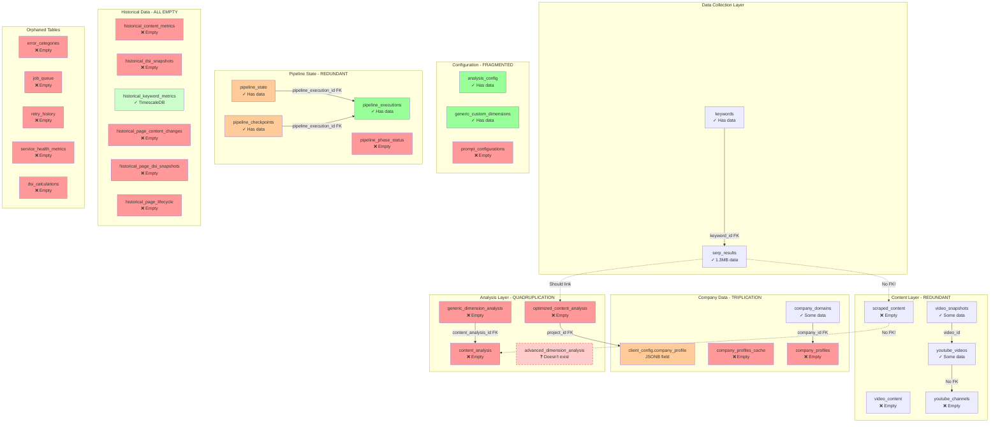
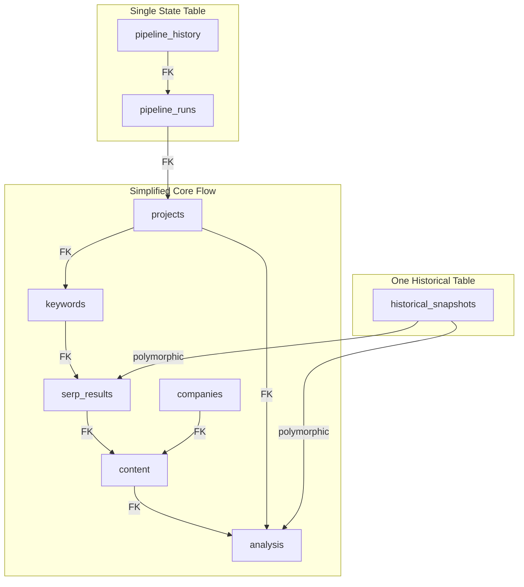

# Database Schema Relationship Diagram

## Core Data Flow



## Legend
- 🟢 **Green**: Tables with data and proper usage
- 🟡 **Yellow**: Tables with some issues
- 🔴 **Red**: Empty or problematic tables
- ⚪ **Dashed**: Missing relationships or non-existent tables

## Major Issues Visualized

### 1. **Broken Data Flow**
```
SERP Results → ❌ → Scraped Content → ❌ → Content Analysis
```
The main data pipeline is broken with no foreign keys connecting the flow.

### 2. **Company Data Redundancy**
```
company_profiles ←→ company_profiles_cache
       ↕
client_config.company_profile (JSONB)
```
Three different places storing the same company information.

### 3. **Analysis Paralysis**
Four different content analysis approaches:
- `content_analysis` (original)
- `generic_dimension_analysis` (generic)
- `optimized_content_analysis` (new)
- `advanced_dimension_analysis` (referenced but doesn't exist!)

### 4. **Historical Data Overengineering**
Six historical tables, all empty, representing different granularities of the same data.

### 5. **Pipeline State Confusion**
```
pipeline_executions
    ├── pipeline_state (current state)
    ├── pipeline_checkpoints (checkpoints)
    └── pipeline_phase_status (empty)
```

## Recommended Simplified Schema



This would reduce 42 tables to ~10-12 core tables with clear relationships and no redundancy.
