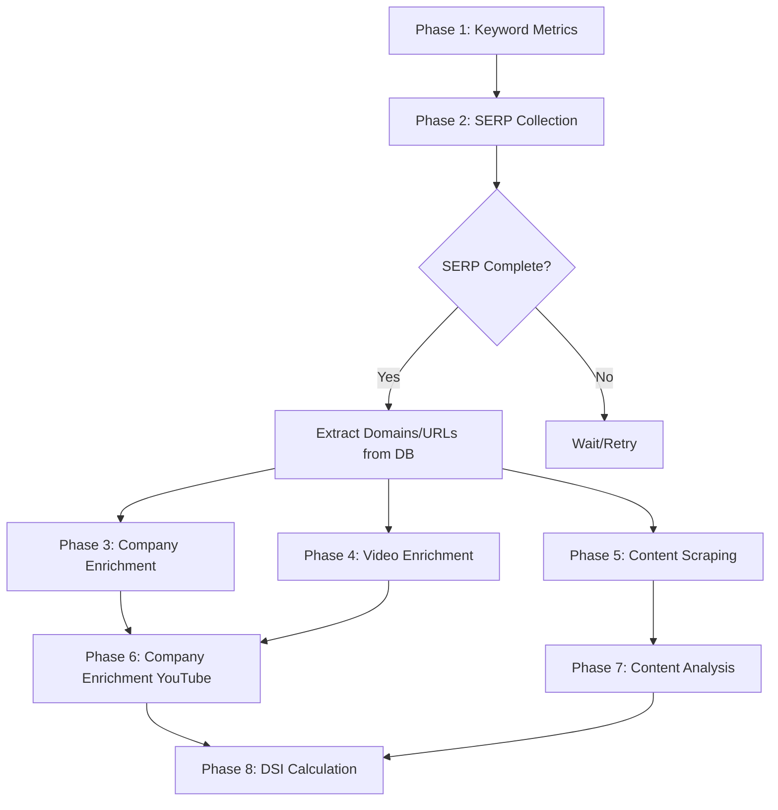

# Pipeline Phase Sequencing and SERP Batch Completion

## Overview

The pipeline execution follows a **strict sequential model** where each phase must complete before the next phase begins. This ensures data integrity and proper dependency management.

## Phase Execution Flow

```python
async def _execute_pipeline(self, pipeline_id: UUID, config: PipelineConfig):
    # Phase 1: Keyword Metrics
    await self._execute_keyword_metrics_enrichment_phase(config, pipeline_id)
    
    # Phase 2: SERP Collection - WAITS FOR FULL COMPLETION
    serp_result = await self._execute_serp_collection_phase(config, pipeline_id)
    
    # Phase 3: Company Enrichment - ONLY STARTS AFTER SERP IS COMPLETE
    if config.enable_company_enrichment and serp_result.get('unique_domains'):
        await self._execute_company_enrichment_phase(serp_result['unique_domains'])
    
    # ... subsequent phases follow the same pattern
```

## SERP Batch Completion Guarantee

### 1. **Batch Creation and Monitoring**

The SERP collection phase uses the Scale SERP batch API with the following flow:

```python
# In unified_serp_collector.py
async def create_and_run_batch(...):
    # 1. Create batch
    batch_id = await self._create_scale_serp_batch(batch_requests)
    
    # 2. Start batch execution
    success = await self._start_batch(batch_id)
    
    # 3. MONITOR UNTIL COMPLETE - This is the key blocking step
    results = await self._monitor_batch_completion(batch_id, ...)
    
    # 4. Only return after all results are stored
    return {
        'success': results.get('stored_count', 0) > 0,
        'batch_id': batch_id,
        'results_stored': results.get('stored_count', 0)
    }
```

### 2. **Batch Monitoring Logic**

The `_monitor_batch_completion` method ensures all results are collected:

```python
async def _monitor_batch_completion(...):
    while (datetime.utcnow() - start_time).total_seconds() < self.batch_timeout:
        # Poll Scale SERP API for batch status
        response = await self.client.get(f"{batch_base_url}/{batch_id}/results")
        
        batch_info = response.json().get('batch', {})
        status = batch_info.get('status', 'unknown')
        
        # Only proceed when batch is complete (status='idle')
        if status == 'idle' and results_count > 0:
            # Download all result pages
            for page_url in pages:
                page_results = await download_results(page_url)
                # Process and store in database
            
            # Process and store all results
            await self._process_batch_results(...)
            return results
        
        # Wait before checking again if still running
        await asyncio.sleep(self.check_interval)
```

### 3. **Data Availability Guarantee**

After SERP collection completes, the pipeline queries the database for the stored results:

```python
# In _execute_serp_collection_phase
if total_results > 0:
    # Query database for domains and URLs from stored SERP results
    unique_domains = await self._get_unique_serp_domains()
    video_urls = await self._get_video_urls_from_serp()
```

## Key Guarantees

1. **Sequential Execution**: Each phase uses `await`, blocking until completion
2. **Batch Completion**: SERP collection waits for Scale SERP batch status to be 'idle'
3. **Data Persistence**: All SERP results are stored in the database before moving forward
4. **Error Handling**: If SERP collection fails, subsequent phases are skipped
5. **State Tracking**: Pipeline state is saved after each phase for recovery

## Phase Dependencies



## Timeout and Error Handling

- **Batch Timeout**: Default 30 minutes (`batch_timeout = 1800`)
- **Check Interval**: Polls every 30 seconds
- **Circuit Breaker**: Protects against API failures
- **State Recovery**: Can resume from last checkpoint

## Verification Points

1. **Log Monitoring**: Look for "✅ DISCRETE BATCHES SUCCESS" before Phase 3 starts
2. **Database Check**: `serp_results` table should be populated before enrichment
3. **WebSocket Updates**: Frontend receives "Collecting SERP data..." then "Enriching company data..."
4. **Phase Results**: Each phase result includes success status and item counts

## Configuration

To adjust timing:
```python
# In UnifiedSERPCollector
self.batch_timeout = 1800  # 30 minutes max wait
self.check_interval = 30   # Check every 30 seconds
```

The current implementation **guarantees** that all SERP batch results are returned and stored in the database before any subsequent phase begins.
